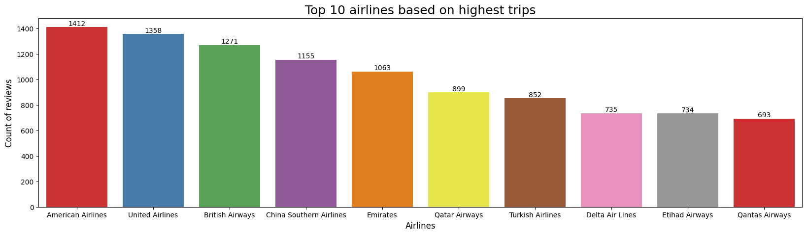
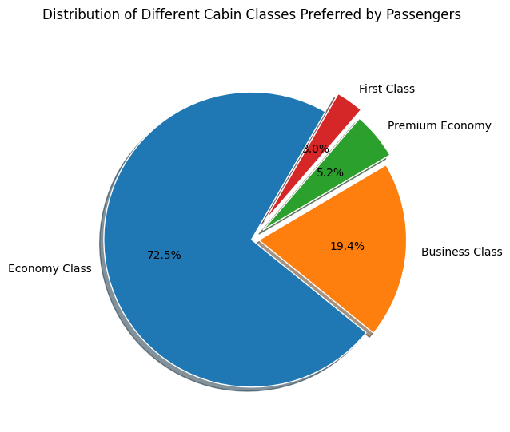
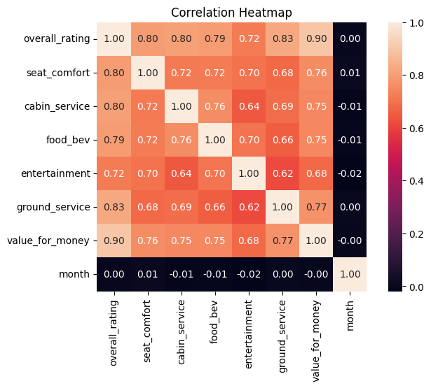
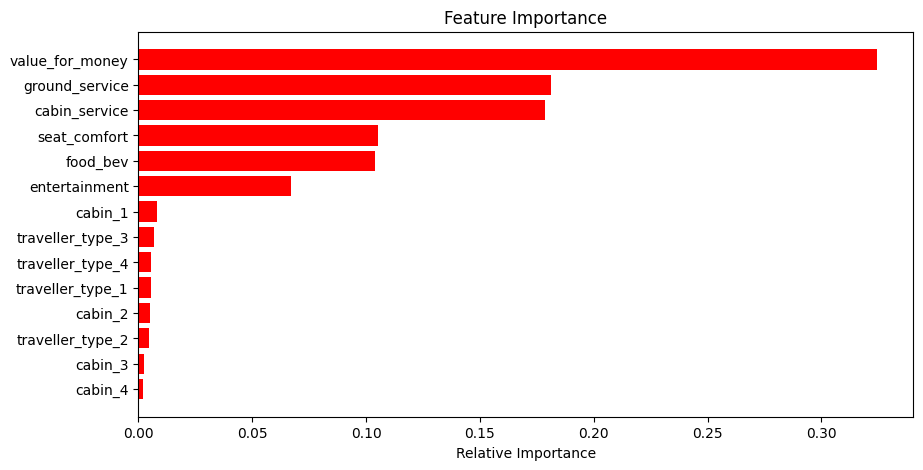

# IndiGo Airline Passenger Referral Prediction

A supervised machine learning project that predicts whether an airline passenger will **recommend (refer) an airline** to friends and family, based on their trip experience and service ratings.


---

## Project Overview

Customer referrals are one of the strongest, lowest-cost growth channels an airline has. A passenger who recommends an airline effectively becomes an unpaid brand ambassador. This project builds a **binary classification model** that predicts whether a passenger will recommend an airline (`Yes` / `No`) using their ratings across the flight experience: seat comfort, cabin service, food & beverages, in-flight entertainment, ground service, value for money, and cabin class.

The end goal is to give airlines an early, data-driven signal on **which passengers are likely to become promoters or detractors**, so they can act on it - targeted loyalty offers, proactive service recovery, or codeshare/partnership decisions.

## Visual Highlights

<table>
<tr>
<td width="50%"></td>
<td width="50%"></td>
</tr>
<tr>
<td width="50%"></td>
<td width="50%"></td>
</tr>
</table>

More charts (missing-value analysis, rating distributions, PCA variance, confusion matrices) are in [`assets/`](assets/) and in the full notebook.

## Problem Statement

Given historical passenger reviews and service ratings, classify whether a passenger would recommend the airline to others. Specifically, the project aims to:

- Build a classifier that predicts the likelihood of a customer recommending the airline.
- Identify which service dimensions (seat comfort, food, entertainment, ground service, value for money, etc.) most influence a recommendation.
- Translate model output into actionable insight airlines can use for retention, service improvement, and marketing.

## Dataset

- **Source**: Airline passenger reviews scraped from [airlinequality.com](https://www.airlinequality.com), covering reviews from 2006–2019. This is the same family of publicly available "Airline Reviews" datasets found on Kaggle (e.g. search *"Airline Reviews airlinequality"*) - the raw file is not included in this repo due to size.
- **Raw size**: 131,895 rows × 17 columns.
- **After cleaning** (deduping, dropping high-null columns, imputing, dropping remaining nulls, removing the leaky `overall_rating` field): 23,606 rows × 13 columns.
- **Key columns used**: `cabin` (class), `seat_comfort`, `cabin_service`, `food_bev`, `entertainment`, `ground_service`, `value_for_money`, `traveller_type`, `recommended` (target).

> To reproduce results, download an equivalent airline-reviews CSV and place it under `data/` (see [How to Run](#-how-to-run)).

## Approach

1. **Data cleaning** - removed duplicates, dropped columns with excessive missing values (`aircraft`, `author`, `customer_review`, `route`), imputed `food_bev` with the column mean, dropped remaining nulls, fixed data types and dates.
2. **Exploratory Data Analysis (EDA)** - 13 charts covering univariate, bivariate, and multivariate relationships (top airlines by review volume, cabin class distribution, rating distributions, correlation heatmap, pair plots, etc.) to understand what drives recommendations.
3. **Hypothesis testing** - three hypotheses tested with two-sample t-tests, chi-square tests, and ANOVA to statistically validate relationships (e.g. rating differences across airlines, association between traveller type and recommendation, seat comfort differences across cabins).
4. **Feature engineering**
   - One-hot / ordinal encoding for categorical features (`cabin`, `traveller_type`).
   - Label encoding for the target (`recommended`).
   - Dropped `overall_rating` to prevent data leakage (it near-perfectly determines the target).
   - **PCA** used to reduce 11 numeric features down to **6 principal components**, retaining ~90% of variance.
5. **Train/test split** - 70/30 hold-out split (`X_train`: 16,524 rows, `X_test`: 7,082 rows).
6. **Modeling** — four classifiers trained, evaluated, and hyperparameter-tuned:
   - Decision Tree (`GridSearchCV`)
   - K-Nearest Neighbors (`GridSearchCV`)
   - Support Vector Machine (`RandomizedSearchCV`)
   - Random Forest (`RandomizedSearchCV`)
7. **Model explainability** - Random Forest feature importances used to interpret which service attributes matter most, independent of the final chosen model.
8. **Deployment prep** - final model serialized with both `pickle` and `joblib`, then reloaded to sanity-check predictions on unseen inputs.

## Model Results

F1-score was chosen as the primary evaluation metric (harmonic mean of precision & recall) since false positives and false negatives carry comparable business cost here.

| Model | Test F1 (before tuning) | Test F1 (after tuning) | Train F1 (after tuning) |
|---|---|---|---|
| Decision Tree | 0.90 | 0.932 | 0.938 |
| K-Nearest Neighbors | 0.92 | 0.932 | 0.938 |
| Random Forest | 0.92 | 0.93 | 0.94 |
| **Support Vector Machine (final model)** | 0.936 | 0.937 | 0.940 |

**Final model: Support Vector Machine (SVM).** It was chosen over the alternatives because it showed the smallest train–test gap (least overfitting) both before and after tuning, generalizing best to unseen passengers.

## Key Business Insights

- Passengers who give an **overall rating above 8 are almost certain (~99%) to recommend** the airline - a simple, actionable early signal.
- **Economy class dominates travel volume** (72.5%), followed by Business (19.4%); service investments aimed at Economy passengers affect the largest share of customers.
- **Service rating above 3** (on the per-category scale) is the tipping point after which a passenger becomes likely to recommend the airline, across every cabin class.
- Review volume spikes in **January, July, and August** - likely holiday travel peaks and suggesting airlines should staff up service teams during these months to protect satisfaction scores.
- Seat comfort, cabin service, ground service, and value for money were the most influential features in predicting recommendation, per Random Forest feature importance.

## Repository Structure

```
IndiGo-Airline-Passenger-Referral-Prediction/
├── notebooks/
│   └── IndiGo_Airline_Passenger_Referral_Prediction.ipynb   # Complete analysis: EDA → Modeling → Evaluation
├── models/
│   └── README.md               # Notes on regenerating serialized model artifacts
├── requirements.txt            # Python dependencies
├── .gitignore
├── LICENSE
└── README.md
```

## Tech Stack

- **Language**: Python 3.9+
- **Data handling**: pandas, NumPy
- **Visualization**: Matplotlib, Seaborn, missingno
- **Statistics**: SciPy (t-test, chi-square, ANOVA)
- **ML / preprocessing**: scikit-learn, category_encoders
- **Model persistence**: pickle, joblib

## How to Run

```bash
# 1. Clone the repo
git clone https://github.com/<your-username>/IndiGo-Airline-Passenger-Referral-Prediction.git
cd IndiGo-Airline-Passenger-Referral-Prediction

# 2. Create a virtual environment and install dependencies
python -m venv venv
source venv/bin/activate        # On Windows: venv\Scripts\activate
pip install -r requirements.txt

# 3. Add the dataset
# Place an airline-reviews CSV (see Dataset section above) under a local `data/` folder,
# and update the file path in the notebook's data-loading cell to point to it.

# 4. Launch the notebook
jupyter notebook notebooks/IndiGo_Airline_Passenger_Referral_Prediction.ipynb
```

## Future Work

- Package the final SVM pipeline (encoding → PCA → model) behind a REST API (FastAPI/Flask) for real-time scoring.
- Retrain on more recent review data to keep the model current with evolving passenger expectations.
- Incorporate NLP on free-text reviews (currently dropped) as additional model features.
- Explore ensemble/stacking approaches combining SVM and Random Forest.

## 👤 Author

**Aryan Roy**
Data Analyst | MCS in AI/ML, IIT Guwahati

## 📄 License

This project is licensed under the [MIT License](LICENSE).
